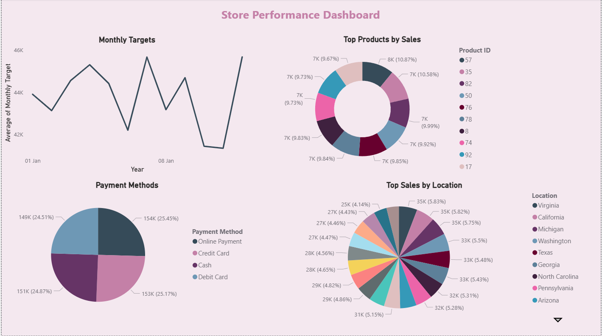

# 🛒 Store Performance Dashboard (Power BI)

This Power BI project provides an interactive and visually clean **Store Performance Dashboard** designed to analyze sales trends, product performance, customer demographics, and store targets.  
It uses a proper **star schema data model**, ensuring accuracy, smooth filtering, and professional BI reporting.

---

## 📌 Project Overview

The dashboard provides a complete view of store operations by combining multiple data tables—customers, salespersons, products, monthly targets, and transactional fact data.  
It highlights **top-selling products, store targets, payment method distribution, and location-based performance**, helping stakeholders make quick, data-driven decisions.

---

## 🧩 Data Model & Structure

A star-schema model was used:

### **Fact Table**
- Sales transactions  
- Contains Product ID, Customer ID, Salesperson ID, Quantity Sold, Quantity Returned, Payment Method, Order Date, Month  

### **Dimension Tables**
- **customers_table** – Customer details with location & demographics  
- **products_table** – Product catalog (name, category, price, cost, profit per product)  
- **sales_persons_table** – Sales team details  
- **monthly_store_targets** – Monthly revenue targets for each salesperson  
- **fact_table** – Central table connecting all dimensions  

### **Relationships**
- One-to-many relationships between:
  - Customers → Fact Table  
  - Products → Fact Table  
  - Salespersons → Fact Table  
  - Monthly Targets → Salespersons  
- Fully optimized for correct filtering and aggregation  

---

## 📊 Key Insights & Visuals

### **1. Monthly Targets Trend**
A line chart showing:
- Average monthly sales targets  
- Variations across months  
- Useful for performance tracking & planning  

### **2. Top Products by Sales**
A donut chart ranking products based on total sales volume to identify:
- Best-selling product categories  
- Most profitable product lines  

### **3. Payment Methods Distribution**
Breakdown of sales by:
- Credit Card  
- Debit Card  
- Online Payment  
- Cash  

Helps understand customer purchasing behavior.

### **4. Top Sales by Location**
A multi-category donut chart displaying:
- Sales contribution by state/location  
- High-performing regions and emerging markets  

### **5. Customer Demographics**
Integrated dataset provides:
- Gender distribution  
- Age groups via Date of Birth  
- Locations with highest customer activity  

---

## 🛠 Tools & Techniques Used

- **Power BI Desktop**
- **Data Modeling (Star Schema)**
- **DAX Calculations** for measures (sales, profit, targets)
- **Power Query** for data cleaning and transformation
- **Custom Visual Formatting**
- **Slicers & Interactions**
- **Modern color palette & layout design**

---

## 🎯 Purpose of the Project

This dashboard demonstrates:
- Strong understanding of Power BI fundamentals  
- Ability to clean, model, and visualize real-world business data  
- Skills in creating easy-to-interpret dashboards for non-technical users  
- Use of BI storytelling through charts, color themes, and layout arrangement  

It is ideal for store managers, business analysts, decision-makers, and performance monitoring teams.

---

## 📸 Dashboard Preview  

